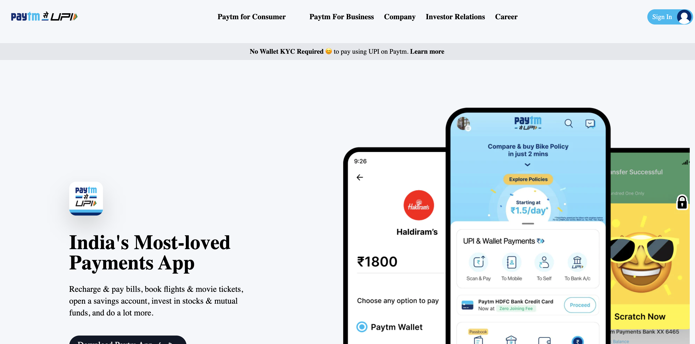

**Paytm Clone using TAILWIND CSS**
--------------------------------------
-----------------------------------------
   

[Deployed Link](https://paytm-clone-by-hs.netlify.app/)

What I learned from this Project?

- Implemented Responsive webpages using media query breakponts from Tailwind CSS
- Showed videos, animations using HTML tags and tailwind CSS.
- Learned and implemented class, tag based selection of HTML elements.